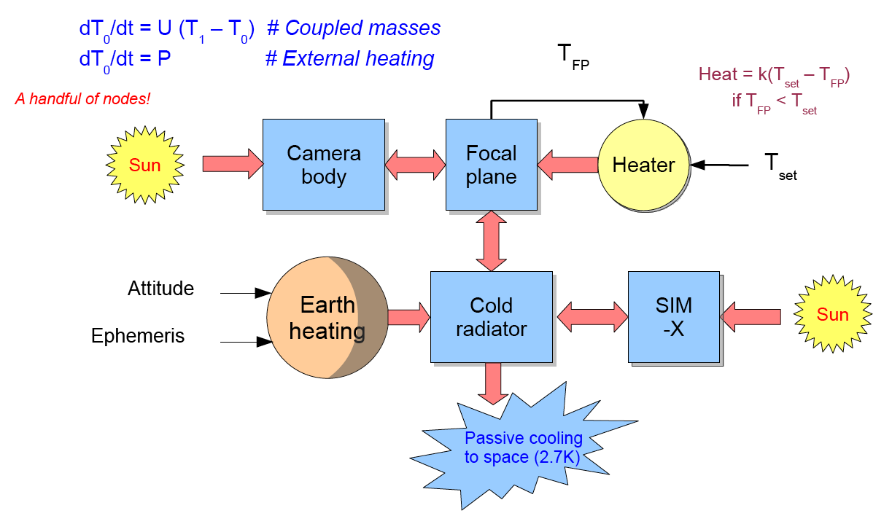

Design overview
==================

The key requirements that drive the Xija design are the following:

* Solve coupled first order differential equations:

.. image:: first_order_ode_dark.png
   :width: 25 %

* The A coupling matrix and B vector can both depend on time, the output data
  values Y and the model parameters p
* Handle time series up to ~1e6 elements long.
* Choice of minimization algorithms (fast versus robust)
* Handle models with up to ~100 parameters

Xija features
-----------------
* Modular and extensible
* Model definition via Python code or static JSON data structure
* Interactive and iterative model development and fitting
* Switch between predicting nodes or using truth (training) data
* Key integration steps coded in C for speed
* GUI interface for model fitting
* Fitting engine provided by `Sherpa <http://cxc.harvard.edu/contrib/sherpa>`_.

Conceptual overview
^^^^^^^^^^^^^^^^^^^^

The schematic diagram below of the ACIS focal plane model graphically illustrates the basic
idea of the Xija framework.  A model consists of one or more nodes (blue boxes) which
can be heated or cooled in different ways:

* Coupling to other nodes (red arrows)
* External heating from external sources:
  * Sun
  * Electronics (not shown in diagram)
  * Earth
  * Thermostat heater
* Passive cooling to a fixed temperature bath (heat sink)

.. Note::
   The schematic above shows a separate Cold Radiator component, but the actual ACIS FP model
   does not include this component, so the arrows pointing there instead go directly to the
   Focal Plane node.  Also the passive cooling to "space" is not literally to 2.7 K, and the
   real model has other heat sinks that are not shown.

Modular and extensible
^^^^^^^^^^^^^^^^^^^^^^^^^^^^^^^^^^^^^^^^

The ``xija`` package provides functions and classes to assemble and
calculate a thermal model.

At the top level there is a single class :class:`xija.XijaModel` that
encapsulates the key information about a model including the model components,
model parameters, and the times at which the model is evaluated.

Each model component is handled by a
separate Python class.  Some currently implemented examples include:

* :class:`~xija.component.base.ModelComponent` : model component base class (name, parameter methods)
* :class:`~xija.component.base.Node` : single node with a temperature, sigma, data_quantization, etc
* :class:`~xija.component.base.Coupling` : Couple two nodes together (one-way coupling)
* :class:`~xija.component.base.HeatSink` : Fixed temperature external heat bath
* :class:`~xija.component.heat.SolarHeat` : Solar heating (pitch dependent)
* :class:`~xija.component.heat.EarthHeat` : Earth heating of ACIS cold radiator (attitude, ephem dependent)
* :class:`~xija.component.heat.PropHeater` : Proportional heater (P = k * (T - T_set) for T > T_set)
* :class:`~xija.component.heat.ThermostatHeater` : Thermostat heater (with configurable deadband)
* :class:`~xija.component.heat.AcisDpaStatePower` : Heating from ACIS electronics (ACIS config dependent CCDs, FEPs etc)

As needed additional model components can be added.

Single-step integration
^^^^^^^^^^^^^^^^^^^^^^^^^^^^^^^^^^^^^^^^

The very fast state-based analytic solutions used for purely passive
models cannot accomodate model components that depend on the node
temperatures or are continuously variable.  Instead the Xija framework
uses 2nd order Runge-Kutte integration to propagate the node
temperatures.  Model components such as heaters respond to the
most-recently calculated temperatures.  The integration code is
written in C for performance.

Model definition
^^^^^^^^^^^^^^^^^^^^^^^^^^^^^^^^^^^^^^^^

The class-based framework makes it natural to define a model and do
interactive parameter fitting within the Python language.  At the same
time one needs to store the results of model fitting and potentially
iterate the fit process starting with stored parameter values.  This
is done by saving the model definition, fit parameters, and other
relevant fit meta-data to a JSON file.

Interactive and iterative fitting
^^^^^^^^^^^^^^^^^^^^^^^^^^^^^^^^^^^^^^^^

The framework provides a GUI fitting tool to help with visualization
of fit results and parameter values.  This allows for interactive
fitting using CIAO/Sherpa by freezing or thawing various parameters or
groups of parameters.  The Sherpa fitting functionality is separated
from the model evaluation code.

Predictively model a node or use telemetry
^^^^^^^^^^^^^^^^^^^^^^^^^^^^^^^^^^^^^^^^^^^^

One of the key methods for initially narrowing the parameter space in
a complex model is to fit parameters and predict values for a single
node only and use truth values for the other coupled nodes.  The Xija
framework easily allows nodes to be enabled or disabled from the model
fitting and prediction process.  In this way a complex model can be
gradually built up.
