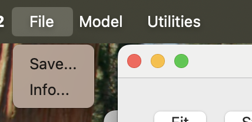
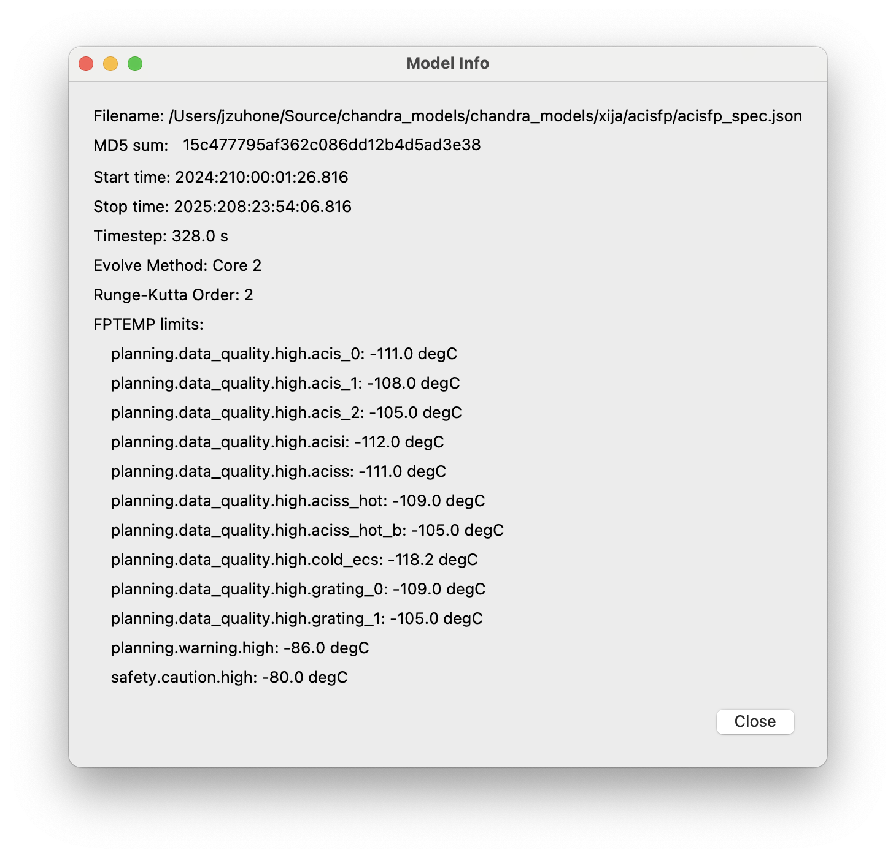
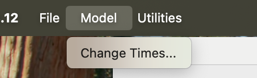
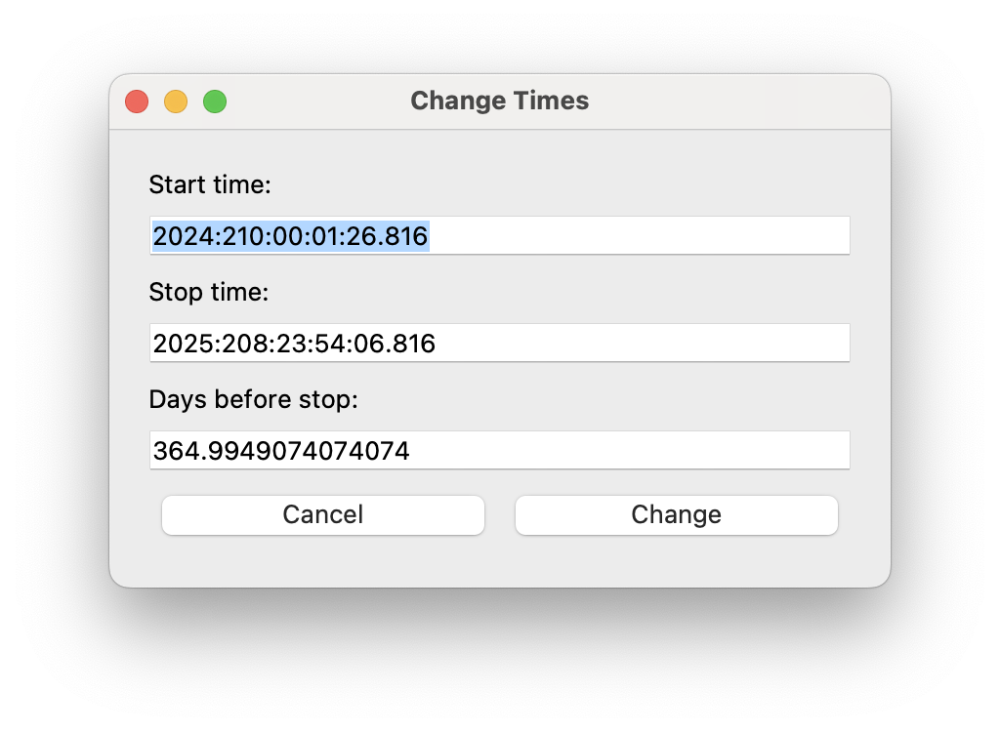
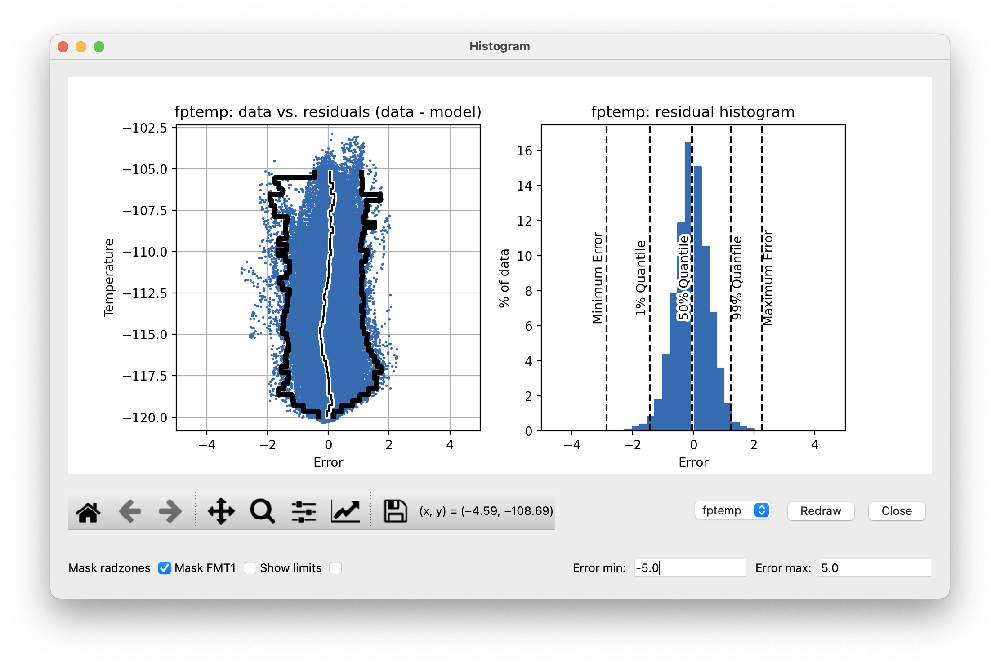
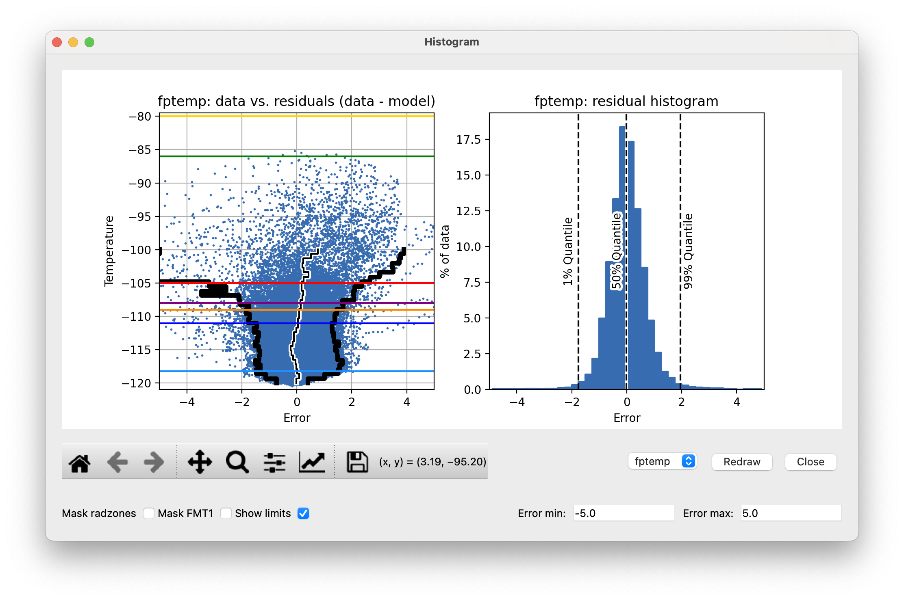
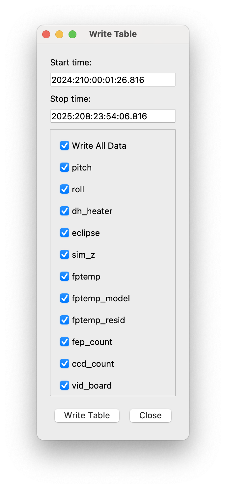

Fitting a model using ``xija_gui_fit``
======================================

So far we have been manually working with a Xija model to understand a bit of
what is going on underneath and know how to make performance predictions.
However, the key task of actually calibrating the model parameters is done with
the ``xija_gui_fit`` application.

``xija_gui_fit`` Overview
-------------------------

The image below shows an example of fitting the ACIS FP model with
``xija_gui_fit``.

Live demo using a Ska window:

.. code-block:: bash

    % cd $XIJA/examples/pcm
    % xija_gui_fit pcm.json --stop 2012:095 --days 30

Command line options
--------------------

The ``xija_gui_fit`` tool supports the following command line options:

.. code-block:: bash

    % xija_gui_fit --help

    usage: xija_gui_fit [-h] [--days DAYS] [--stop STOP] [--maxiter MAXITER]
                        [--fit-method FIT_METHOD] [--inherit-from INHERIT_FROM]
                        [--set-data SET_DATA_EXPRS] [--quiet]
                        filename
    
    positional arguments:
      filename              Model file
    
    optional arguments:
      -h, --help            show this help message and exit
      --days DAYS           Number of days in fit interval (default=90
      --stop STOP           Stop time of fit interval (default=model values)
      --maxiter MAXITER     Maximum number of fit iterations (default=1000)
      --fit-method FIT_METHOD
                            Sherpa fit method (simplex|moncar|levmar)
      --inherit-from INHERIT_FROM
                            Inherit par values from model spec file
      --set-data SET_DATA_EXPRS
                            Set data value as '<comp_name>=<value>'
      --quiet               Suppress screen output

Most of the time you should use the ``--days`` and ``--stop`` options. Note that
if you have saved a model specification and then restart ``xija_gui_fit``, the
most recently specified values will be used by default.

``--fit-method``
  The default fit method is ``simplex`` which is a good compromise between speed
  and completeness. For the fastest fitting use ``levmar``. If already have
  somewhat decent parameters and want to try to refine for the very best fit
  then select ``moncar``. However, do not choose this option with more than
  about 10 or 15 free parameters as it can take a long time. Typically with
  ``moncar`` you need to start the fitting and then do something else for a
  while (many hours or more).  

``--inherit-from``
  This provides a way to construct a model which is similar to an existing
  model but has some differences. All the model parameters which are 
  exactly the same will be taking from the inherited model specification.
 
Assuming you have created a model specification file ``my_model_spec.json``
then a typical calling sequence is:

.. code-block:: bash

    % xija_gui_fit --stop 2012:002 --days 180 my_model_spec.json

Menu Bar Options
----------------

The top-level menu bar has a number of options. The :ref:`utils_menu`
will be discussed below. 

File Menu
^^^^^^^^^

Save...
+++++++

Opens a dialog to save the current model specification file.

Info...
+++++++

The "Info..." option allows one to get some quick information about
the model which is being fit, which includes the full path to the filename,
the MD5 sum of the model JSON file, the start time and the stop time of the
model run, the timestep, the chosen evolution method, the limits for the model,
and the order of the method (RK2 or RK4). If the MD5 of the current model is 
different from the one on disk (due to a parameter change, etc.) it will show 
up in red. 

.. _model_menu:

Model Menu
^^^^^^^^^^

Change Times...
+++++++++++++++

Opens a dialog to change the start and stop times of the model run. This can
be useful if you want to expand the model evalulation to a longer time range
(e.g., in order to include more data for fitting, or better constrain the
long-term pitch parameters). 

There are two ways to update the new times. You can either enter a new start
and/or stop time in the boxes and then press the "Change" button, or you can
select a new stop time and then set the number of days to go back to to
calculate the new start time. Regardless of which method you use, the values
in the boxes will be updated to reflect the new values. 

If you enter an invalid time (e.g. a stop time before or equal to the start 
time, or an invalid date string) or an invalid number of days (e.g. negative, 
zero, or not a number), then the values will turn red until a valid value is
entered. If you enter bad values and then press "Change", a dialog will pop 
up to remind you that the values are bad, with the message depending on the 
reason.

Manipulating Parameters
-----------------------

One of the key features of ``xija_gui_fit`` is the ability to visualize and
manipulate the dozens of parameters in a typical Xija model.  

The parameters are on the right side panel. Each one has a checkbox that
indicates whether it will be fit (checked) or not (unchecked). The value is
shown, then the minimum allowed fit value, a slider bar to select the value,
and then the maximum allowed fit value. As you change the slider the model
will be recalculated and the plots updated. It helps to make the ``xija_gui_fit``
window as wide as possible to make the sliders longer.

If you want to change the min or max values just type in the box and then hit
enter (if you don't hit enter, the new value won't apply).

You can freeze or thaw many parameters at once using the "glob" syntax in the
"Freeze:" or "Thaw:" entry boxes at the top of the fit window. Examples:

.. code-block:: bash

    *               # freeze/thaw all parameters
    solarheat*      # freeze/thaw all the solarheat params
    solarheat*_dP_* # freeze/thaw the long-term solarheat variation params

Plots
-----

Many model components have built-in plots that can be added to the fit window
via the "Add plots..." drop down menu. The available plot names correspond to the
model component followed by a description of the plot. Plots can be deleted by
pressing the corresponding "Delete" button.

For the particular node that is being modeled, there will be a plot showing the data
(blue) and model (red) together vs time. One handy feature is that the time-based 
plots are always linked in the time axis so that if you zoom in or pan on one then 
all plots zoom or pan accordingly. When you want to go back to the full view, you 
can use the "Reset Plots" button. Plots will update in real-time if parameters are
changed, either by moving the sliders, setting values directly, or by fitting.

There are also a few types of plot annotations that may be useful:

Annotate Limits and Radzones
^^^^^^^^^^^^^^^^^^^^^^^^^^^^

If the thermal limits are included in the JSON model specification file, they can
be plotted on the ``data__time`` and ``resid__data`` plots for the modeled 
temperature. To enable this, toggle the "Show limits" checkbox. Different colors
are used for different limits.

It may also be useful to know when the radzones begin and end. Toggling the
"Show radzones" checkbox puts dashed green lines on the time plots indicating the
times of the radzones. 

Annotate Line Option
^^^^^^^^^^^^^^^^^^^^

Clicking the "Annotate line" checkbox adds a brown vertical line to the time plots
which can be dragged around from any plot and its motion will by synchronized between
them. It also pops up a "Line Data" window which shows the values of all of the model
inputs and outputs at the time marked by the brown line. 

Fit Strategy
------------

Fitting Xija models is a bit of an art and will it take some time to develop
skill here. A few rules of thumb and tips:

* Start with all long-term variations frozen. You want to begin with a single time span
  that is about a year long and ends near the present. The more parameters in the model
  that get fit, the more data you need. Start by trying to get the model in the right
  ballpark. Typically this means::

    Freeze?   Parameters         Initial values
    -------   ------------------ ----------------------
    freeze    solarheat_*_dP_*        0
    freeze    solarheat_*_tau       365
    freeze    solarheat_*_ampl        0
    freeze    heatsink_T          ~10 deg below typical
    thaw      solarheat_*_P_*         0
    thaw      heatsink_tau        Typical time scale
    thaw      coupling_*             30

* Almost always have the ``solarheat_*_bias`` terms frozen at 0. This
  parameter is degenerate with the ``solarheat_*_P_*`` values and is used for
  certain diagnostics.

* Once you have a model that fits reasonably well over the one year period, freeze all
  parameters *except* for ``solarheat_*_dP_*`` and ``solarheat_*_ampl`` parameters. Fit
  over a 2-3 year time period which ends at the present time. You can do this by either
  saving the model spec file and then restarting ``xija_gui_fit`` with the new
  ``--days`` and ``--stop`` values, or by using the "Change Times..." option in the
  :ref:`model_menu`.

* Next, you might want to refine the ``solarheat_*_P_*`` parameters at this point by
  thawing those ones and freezing the long-term parameters and fitting. Remember that if
  the time span is not long enough, then ``P`` and ``dP`` are degenerate and the fit may
  not converge.

* It can be useful to include long dwells at the worst-case pitch for your model 
  in the fitting to have some high-temperature data in the fit dataset.

* Remember to save your model fit when you get a good fit. It is not saved by
  default and there is currently no warning to this effect. Often there is a
  progression of model fits and it may be useful to incrementally number the
  models, e.g. ``pcm03t_1.json``, ``pcm03t_2.json``, etc. By convention the
  final "flight" models that get configured are called
  ``<modelname>_model_spec.json``, so avoid using this name during development.

* Saving also saves the state of plots and your parameters.

.. _utils_menu:

Utilities Menu
--------------

A number of other optional features are included with ``xija_gui_fit`` under the
Utilities Menu, which may help with interpreting model fits and other analyses. 

Histogram...
^^^^^^^^^^^^

The "Histogram..." menu item brings up a window which shows two histograms of the
model performance, similar to a dashboard plot. The left histogram shows the
distribution of the residuals (data - model) versus the data temperature. Lines
are drawn for the 1%, 50%, and 99% quantiles. The right histogram shows the 
binned distribution of the residuals, with lines drawn for the 1%, 50%, and 99% 
quantiles.

Though the histogram window can be open while fitting, it will not update
automatically. To update the histograms, press the "Redraw" button.

Note that there are a number of options that can be set to modify the histograms.
First, there is the standard Matplotlib toolbox for zooming, panning, saving, etc.
Second, there are two dialog boxes that can be used to set the limits of the 
residuals. Finally, there are three checkboxes. The "Mask radzones" and "Mask FMT1"
checkboxes will exclude data during radzones and FMT1 periods, respectively. In 
this example, we mask out data from the radzones--note how different the histograms
look from the unmasked version above:

.. note::

    These options may only be useful for certain models, such as the ACIS FP model. 

The "Show limits" checkbox will overplot the thermal limits on the left histogram:

Filters...
^^^^^^^^^^

If you enter an invalid start or stop date, then the bad value(s) will turn 
red until a valid value is entered. If you enter bad values and then press 
"Write Table", a dialog will pop up to remind you that the value(s) are bad, 
with the message depending on the reason.

Write Table...
^^^^^^^^^^^^^^

It may be useful to take a number of model/data outputs associated with the
fitting procedure and output to an ASCII table in the 
`AstroPy ECSV format <https://docs.astropy.org/en/stable/io/ascii/write.html#ecsv-format">`_
The "Write Table..." menu item brings up a window which allows one to select from 
the different quantities which are inputs to the model and its outputs, select 
a time window within which to output data, and then write the quantities to the table.

If you enter an invalid start or stop date, then the bad value(s) will turn 
red until a valid value is entered. If you enter bad values and then press 
"Write Table", a dialog will pop up to remind you that the value(s) are bad, 
with the message depending on the reason.
